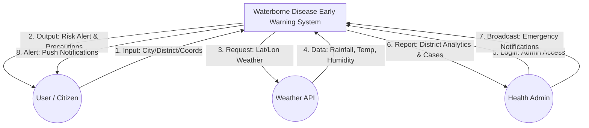
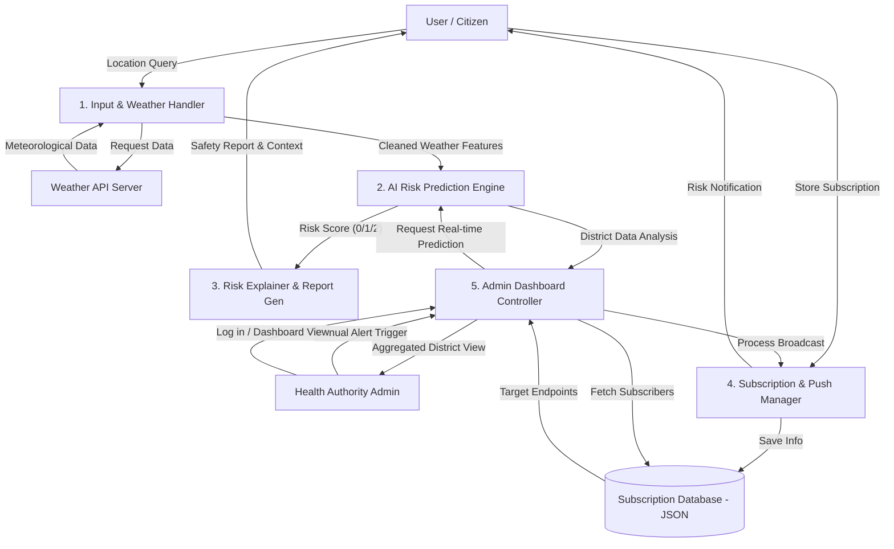
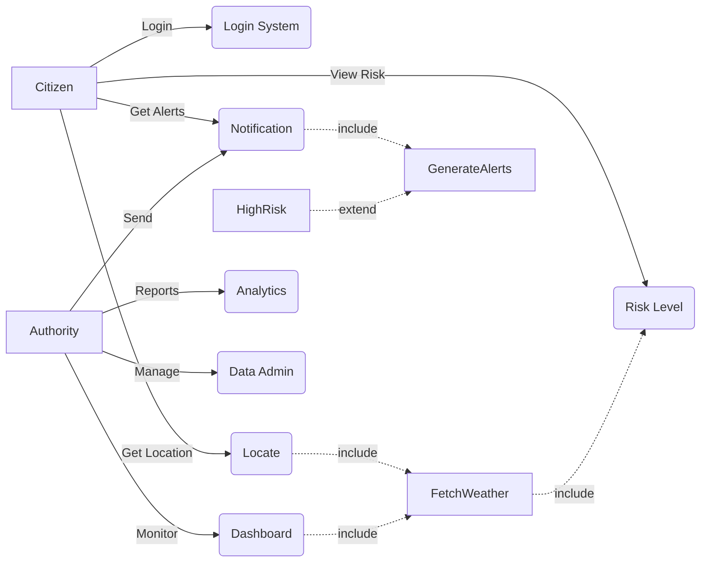
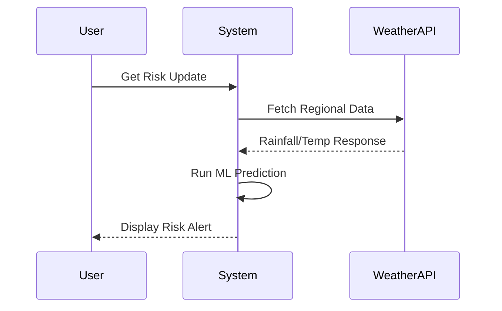
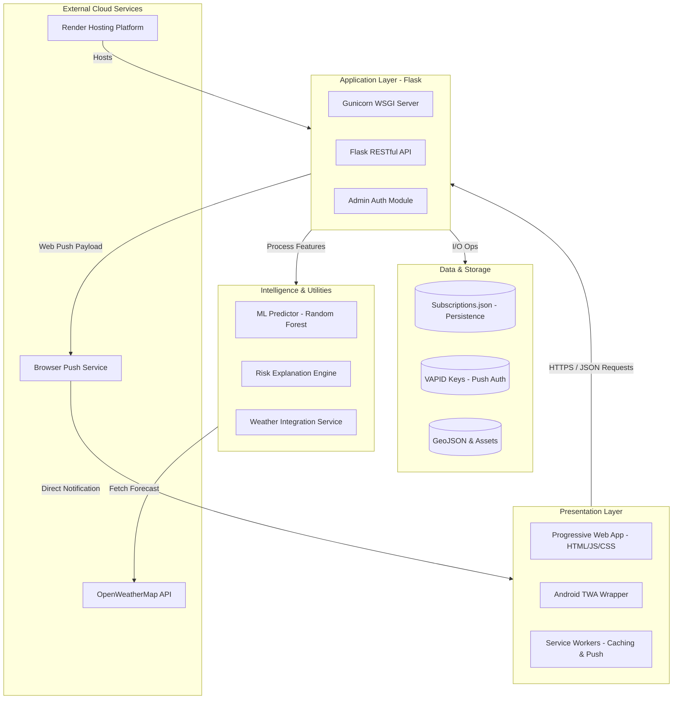

# System Diagrams: Waterborne Disease AI

This document provides a technical overview of the system through Data Flow Diagrams (DFD) and UML models.

---

## 1. Data Flow Diagrams (DFD)

### Level 0: Context Diagram
The Context Diagram shows the system's boundaries and its interactions with external entities.

### Level 1: Multi-Process Diagram
The Level 1 DFD breaks down the internal processes and data stores of the system.

---

## 2. UML Diagrams

### Use Case Diagram (Simplified Model)

### Sequence Diagram

---

## 3. System Architecture
The overall architecture shows how components interact across different layers.

