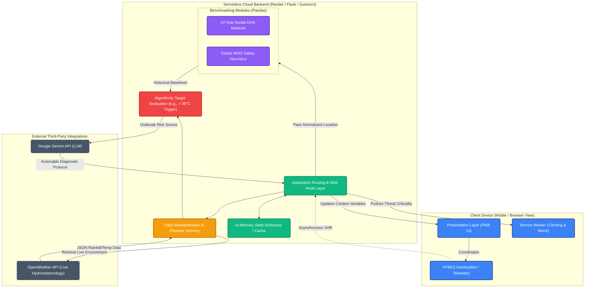
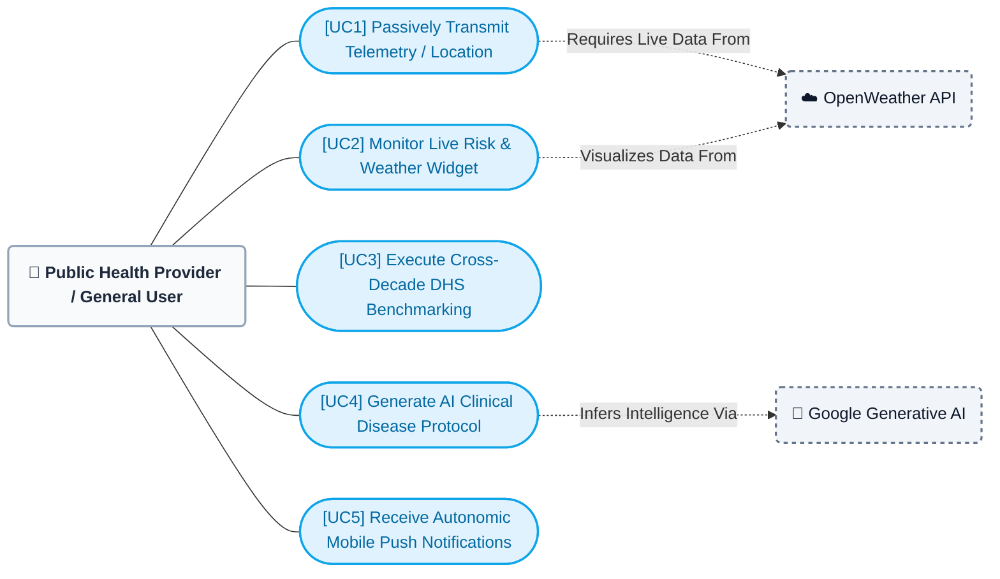

# Waterborne Disease AI - System Diagrams

## 1. System Architecture Diagram

This diagram visualizes the multi-layered, decoupled architecture defined in Chapter 3, representing the data flow from the Progressive Web App (PWA) client to the generative AI protocols.

 

## 2. System Use Case Diagram

This diagram maps the interaction layers between the primary system actors (Human vs AI APIs) and the core functional capabilities described in the software engineering methodology.

